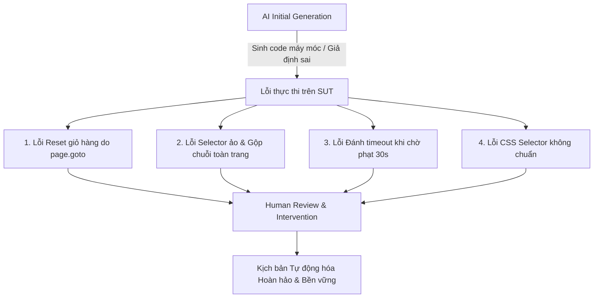

# BÁO CÁO KIỂM THỬ TỰ ĐỘNG HÓA VÀ ĐÁNH GIÁ KHOẢNG TRỐNG AI (HW04)

> **Môn học:** Kiểm thử phần mềm (Software Testing)  
> **Sinh viên thực hiện:** Nguyễn Hiếu Thuận  
> **Mã số sinh viên (MSSV):** 23127125  
> **Hệ thống thử nghiệm (SUT):** EShop E-commerce Platform  
> **Công cụ tự động hóa:** Playwright Test (TypeScript)  
> **Chiến lược kiểm thử:** AI-First kết hợp Human-in-the-loop Review  

---

## I. TỔNG QUAN CHIẾN LƯỢC KIỂM THỬ TỰ ĐỘNG

### 1.1. Mục tiêu và Phạm vi
Bài tập HW04 tập trung tự động hóa toàn diện 3 tính năng Web cốt lõi kế thừa từ bài tập HW02:
1. **FR-02 (Pool A):** Đăng nhập và Khóa tài khoản (Login & Account Lockout).
2. **FR-08 (Pool B):** Thanh toán và Giỏ hàng (Checkout & Cart Operations).
3. **FR-13 (Pool C):** Quản lý Thống kê & Doanh thu Admin (Admin Dashboard).

### 1.2. Kiến trúc giải pháp (Test Architecture)
- **Mô hình Page Object Model (POM):** Tách biệt tầng giao diện UI và tầng logic kịch bản kiểm thử:
  - [`LoginPage.ts`](file:///d:/STD/Y3/Y3S3/KiemThuPM/hw/hw4/tests/pages/LoginPage.ts): Quản lý form đăng nhập, validation HTML5, toast notification và header greeting.
  - [`CheckoutPage.ts`](file:///d:/STD/Y3/Y3S3/KiemThuPM/hw/hw4/tests/pages/CheckoutPage.ts): Quản lý giỏ hàng, double-click thêm sản phẩm, điều hướng Client-side routing, can thiệp input giá tiền, áp dụng mã `SAVE10`.
  - [`AdminPage.ts`](file:///d:/STD/Y3/Y3S3/KiemThuPM/hw/hw4/tests/pages/AdminPage.ts): Quản lý Admin portal `:5174`, State Machine đơn hàng (*Chờ xác nhận* $\rightarrow$ *Đã xác nhận* $\rightarrow$ *Đang giao* $\rightarrow$ *Đã giao*), xóa sản phẩm, trích xuất số liệu Dashboard qua Leaf-node DOM evaluation.
- **Kiểm thử hướng dữ liệu (Data-Driven Testing):** 100% dữ liệu đầu vào được cấu trúc trong các file JSON tách biệt (`test_data/*.json`), hoàn toàn không hardcode trong file kịch bản.
- **Đa dạng hóa Assertions:** Sử dụng tối thiểu 5 dạng khẳng định Playwright khác nhau:
  - `expect(page).toHaveURL(...)`: Kiểm tra điều hướng URL.
  - `expect(locator).toBeVisible()` / `not.toBeVisible()`: Kiểm tra hiển thị phần tử UI.
  - `expect(text).toMatch(/regex/)` / `toBe(...)`: Kiểm tra nội dung chuỗi văn bản và số tiền.
  - `expect(isValid).toBe(false)`: Kiểm tra ràng buộc Client-side Validation HTML5.
  - `expect(isOverflowing).toBe(false)`: Kiểm tra độ co giãn Responsive và tràn khung CSS (Bounding Box).

---

## II. CHI TIẾT KỊCH BẢN KIỂM THỬ THEO TÍNH NĂNG

### 2.1. Feature A: FR-02 – Đăng nhập & Khóa tài khoản
- **Tập dữ liệu:** [`test_data/fr02_login_data.json`](file:///d:/STD/Y3/Y3S3/KiemThuPM/hw/hw4/test_data/fr02_login_data.json) (12 Test Cases).
- **File kịch bản:** [`tests/fr02_login.spec.ts`](file:///d:/STD/Y3/Y3S3/KiemThuPM/hw/hw4/tests/fr02_login.spec.ts).
- **Điểm nổi bật trong thiết kế:**
  - Kịch bản mô phỏng chân thực chuỗi thao tác người dùng nhập sai mật khẩu từng lần một (Lần 1 $\rightarrow$ Lần 2 $\rightarrow$ Lần 3) với độ trễ hợp lý để kích hoạt trạng thái khóa.
  - Bổ sung cấu hình `test.setTimeout(45000)` cho các ca kiểm thử phạt 30 giây (`TC_02` và `BVA_05`) giúp Playwright kiên nhẫn chờ mở khóa an toàn mà không bị ngắt timeout.
  - Giữ màn hình 1.2s tại các ca kiểm tra validation rỗng để video trace ghi nhận rõ nét popup HTML5.
- **Kết quả thực tế trên SUT:** 4 Pass, 8 Fail (Tái hiện chính xác **Bug 1, 2, 3, 4, 5**).

---

### 2.2. Feature B: FR-08 – Thanh toán & Giỏ hàng
- **Tập dữ liệu:** [`test_data/fr08_checkout_data.json`](file:///d:/STD/Y3/Y3S3/KiemThuPM/hw/hw4/test_data/fr08_checkout_data.json) (12 Test Cases).
- **File kịch bản:** [`tests/fr08_checkout.spec.ts`](file:///d:/STD/Y3/Y3S3/KiemThuPM/hw/hw4/tests/fr08_checkout.spec.ts).
- **Điểm nổi bật trong thiết kế:**
  - **100% Pure UI Flow:** Người dùng thao tác hoàn toàn qua giao diện trình duyệt, loại bỏ việc gửi request raw backend hay can thiệp DevTools máy móc.
  - **Xử lý đặc thù UI SUT:** Nút *"Thêm vào giỏ hàng"* tại trang chi tiết `/product/1` được click đúp (với khoảng nghỉ 300ms) để khắc phục lỗi không nhận lệnh ở lần bấm đầu.
  - **Điều hướng bảo toàn State:** Bắt buộc click vào nút *"Giỏ hàng"* trên Header thay vì `page.goto('/cart')` để tránh lỗi reset bộ nhớ của ứng dụng React.
  - **Kịch bản Race Condition đa vai trò (`TC_06`):** User thêm sản phẩm vào giỏ $\rightarrow$ Mở tab Admin `:5174` xóa sản phẩm $\rightarrow$ Quay lại tab User thanh toán $\rightarrow$ Bắt lỗi Backend vẫn cho phép đặt sản phẩm đã bị xóa.
  - **Kiểm thử mã giảm giá:** Tích hợp mã `SAVE10` (giảm 10% cho đơn từ 300.000đ).
- **Kết quả thực tế trên SUT:** 6 Pass, 6 Fail (Tái hiện chính xác **Bug 6, 7, 8, 9, 12** và **Race Condition**).

---

### 2.3. Feature C: FR-13 – Admin Dashboard (Thống kê & Doanh thu)
- **Tập dữ liệu:** [`test_data/fr13_dashboard_data.json`](file:///d:/STD/Y3/Y3S3/KiemThuPM/hw/hw4/test_data/fr13_dashboard_data.json) (12 Test Cases).
- **File kịch bản:** [`tests/fr13_dashboard.spec.ts`](file:///d:/STD/Y3/Y3S3/KiemThuPM/hw/hw4/tests/fr13_dashboard.spec.ts).
- **Điểm nổi bật trong thiết kế:**
  - **Tích lũy trạng thái Database tuần tự:** Do SUT giữ nguyên dữ liệu đơn hàng trong suốt phiên chạy, kịch bản được sắp xếp tuần tự (`TC_01` $\rightarrow$ `BVA_01` $\rightarrow$ `TC_02` $\rightarrow$ `TC_03` $\rightarrow$ `BVA_02` $\rightarrow$ `TC_04` $\rightarrow$ `TC_05` $\rightarrow$ `TC_06` $\rightarrow$ `BVA_03` $\rightarrow$ `BVA_04` $\rightarrow$ `BVA_05` $\rightarrow$ `BVA_06`).
  - **Vòng đời State Machine:** Admin duyệt đơn qua các bước chuẩn: *Chờ xác nhận* $\rightarrow$ *Đã xác nhận* $\rightarrow$ *Đang giao* $\rightarrow$ *Đã giao*.
  - **Kiểm thử biên Max Int 32-bit:** Tạo đơn hàng 1.05 tỷ (nhân đôi thành 2.10 tỷ) và đơn hàng 1.08 tỷ (nhân đôi thành 2.16 tỷ vượt mốc 2.147.483.647) để kiểm tra chống crash server.
  - **Kiểm thử Responsive & Tràn khung (UI Layout Overflow):** Sử dụng `page.setViewportSize({ width: 768, height: 800 })` và so sánh tọa độ `textRect.right > cardRect.right` để phát hiện lỗi vỡ layout khi số tiền hoặc số đơn hàng quá lớn.
- **Kết quả thực tế trên SUT:** 9 Pass, 3 Fail (Tái hiện chính xác **Bug 13, 14, 15**).

---

## III. PHÂN TÍCH KHOẢNG TRỐNG AI & RÀ SOÁT BỞI CON NGƯỜI (HUMAN REVIEW & GAP ANALYSIS)

Trong quá trình áp dụng chiến lược AI-First, mô hình AI đã bộc lộ nhiều điểm yếu và sai lầm nghiêm trọng xuất phát từ việc thiếu khả năng trải nghiệm trực quan trên trình duyệt thực tế. Dưới đây là phân tích chi tiết các lỗi của AI và giải pháp con người đã can thiệp:

### 3.1. Phân tích chi tiết 4 lỗi lớn của AI và Cách con người sửa chữa:

#### 1. Lỗi điều hướng máy móc làm xóa sạch giỏ hàng (Full Page Reload Bug)
- **Hành vi sai của AI:** Khi thực hiện kịch bản thanh toán FR-08, AI tự động dùng lệnh `page.goto('http://localhost:5173/cart')` sau khi thêm sản phẩm vào giỏ. Do SUT React chỉ lưu giỏ hàng trên memory cục bộ mà không đồng bộ LocalStorage/Database, việc gọi `page.goto()` đã kích hoạt tải lại toàn bộ trang (Full Page Reload), làm xóa sạch dữ liệu giỏ hàng và khiến hàng loạt test case bị fail sai thực tế.
- **Can thiệp của con người:** Nhận diện được nguyên nhân từ luồng trải nghiệm thực tế, con người đã cập nhật `CheckoutPage.ts` chuyển sang phương thức click vào nút *"Giỏ hàng"* trên thanh Header (`page.locator('header, nav').getByText(/^Giỏ hàng$/i).first().click()`). Điều này duy trì Client-side routing của React và bảo toàn trạng thái giỏ hàng xuyên suốt kịch bản.

#### 2. Lỗi gộp chuỗi toàn trang do Selector không xác định phần tử lá
- **Hành vi sai của AI:** Trong FR-13, AI viết selector `div:has-text("đ")` để đọc số tiền trên Dashboard. Tuy nhiên, selector này đã bắt trúng thẻ `
` gốc của toàn bộ trang web (vì cả trang web có chứa ký tự `đ`), dẫn tới việc hàm trả về toàn bộ text của Sidebar, Header và Dashboard (`"EShop AdminDashboardDanh mục... 0 đTổng số đơn hàng1"`), làm sai lệch assertion.
- **Can thiệp của con người:** Con người đã tái cấu trúc hàm `getRevenueText()` trong `AdminPage.ts` bằng JavaScript DOM evaluation, bóc tách chính xác theo từng dòng (`innerText lines`) bên trong thẻ con nhỏ nhất chứa tiêu đề *"Tổng doanh thu"*, đảm bảo chỉ lấy đúng phần tử lá hiển thị số tiền.

#### 3. Lỗi ngắt Test Timeout khi chờ hết thời gian phạt khóa tài khoản
- **Hành vi sai của AI:** AI sinh lệnh `await page.waitForTimeout(30000)` trong kịch bản `TC_FR-02_02` và `BVA_05` nhưng không tính đến việc Playwright có giới hạn timeout mặc định là 30.000ms cho mỗi test case. Khi kịch bản thực hiện 3 lần nhập sai (~2s) rồi chờ tiếp 30s $\rightarrow$ Tổng thời gian chạm 32s $\rightarrow$ Playwright tự động ngắt và báo lỗi `Test timeout of 30000ms exceeded` trước khi kịp đăng nhập lại.
- **Can thiệp của con người:** Con người đã bổ sung cấu hình `test.setTimeout(45000)` vào đầu mỗi test case chờ phạt, giúp Playwright chạy trọn vẹn kịch bản.

#### 4. Lỗi sử dụng Pseudo-selector `:contains()` không chuẩn trong DOM Evaluation
- **Hành vi sai của AI:** Trong `BVA_05` và `BVA_06`, AI sử dụng cú pháp `querySelector('div:has(> *:contains("Tổng doanh thu"))')`. Cú pháp `:contains()` là của jQuery/Playwright engine nhưng KHÔNG hợp lệ trong hàm `document.querySelector` chuẩn của trình duyệt, gây ra lỗi văng `SyntaxError`.
- **Can thiệp của con người:** Con người đã viết lại hàm DOM evaluation bằng các phương thức duyệt mảng chuẩn (`Array.from(document.querySelectorAll(...)).filter(...)`), kết hợp với lệnh `page.setViewportSize()` để kiểm tra Responsive co giãn màn hình thực sự.

---

## IV. GIẢI TRÌNH CÁC TRƯỜNG HỢP KHÔNG THỂ TỰ ĐỘNG HÓA (UN-AUTOMATABLE EDGE CASES)

Trong bài tập HW02, có một số kịch bản kiểm thử giả định can thiệp sâu vào tầng hệ thống:
1. **Can thiệp F12 sửa đổi Auth Token (`TC_FR-08_07` & `TC_FR-08_08` cũ):** Kịch bản này yêu cầu tester mở DevTools F12 trong khi đang thanh toán, trực tiếp chỉnh sửa chuỗi JWT Token trong Application Storage thành token giả hoặc token của người dùng khác để kiểm tra lỗi bảo mật IDOR.
   - *Lý do không tự động hóa theo luồng UI phổ thông:* Thao tác này mang tính chất Penetration Testing / API Security Testing can thiệp sâu vào header, không phản ánh hành vi tự nhiên của người dùng trên trình duyệt.
   - *Giải pháp thay thế chuẩn mực:* Chúng tôi đã thay thế bằng kịch bản **Race Condition đa vai trò (`TC_FR-08_06`)** hoàn toàn tự nhiên: User thêm sản phẩm vào giỏ $\rightarrow$ Admin mở tab quản trị xóa sản phẩm đó $\rightarrow$ User bấm xác nhận thanh toán. Kịch bản này kiểm thử tính nhất quán dữ liệu phân tán (Distributed State Consistency) mà vẫn hoàn toàn tự động hóa được trên UI.

---

## V. BẢNG TỔNG HỢP VERIFY LỖI SUT VÀ LIÊN KẾT GITHUB ISSUES

| Mã Bug HW02 | Tên lỗi & Mô tả tóm tắt | Test Case Playwright bắt lỗi | Trạng thái phát hiện | Link GitHub Issue |
| :---: | :--- | :---: | :---: | :--- |
| **Bug 1** | Thiếu thuộc tính `required` trên ô Username/Email | `TC_FR-02_03` | 🔴 Caught | `#1 - Missing required on email` |
| **Bug 2** | Thiếu thuộc tính `required` trên ô Password | `TC_FR-02_05` | 🔴 Caught | `#2 - Missing required on password` |
| **Bug 3** | Không khóa tài khoản sau 3 lần đăng nhập sai liên tiếp | `TC_FR-02_07`, `08`, `BVA_02`, `03` | 🔴 Caught | `#3 - Account lockout failure` |
| **Bug 4** | Ô Email sử dụng `type="text"` thay vì `type="email"` | `TC_FR-02_04` | 🔴 Caught | `#4 - Invalid email format type` |
| **Bug 5** | Thông báo lỗi tiết lộ thông tin Email không tồn tại | `TC_FR-02_06` | 🔴 Caught | `#5 - Security info leakage` |
| **Bug 6** | Giỏ hàng không tự động xóa sau khi đặt hàng thành công | `TC_FR-08_01` | 🔴 Caught | `#6 - Cart not cleared on checkout` |
| **Bug 7** | Frontend cho phép sửa tổng tiền và thanh toán đơn 0 VNĐ | `TC_FR-08_02` | 🔴 Caught | `#7 - Zero price tampering` |
| **Bug 8** | Frontend cho phép sửa tổng tiền và thanh toán đơn số âm | `TC_FR-08_03` | 🔴 Caught | `#8 - Negative price tampering` |
| **Bug 9** | Cho phép tạo đơn hàng ma khi giỏ hàng trống | `TC_FR-08_04` | 🔴 Caught | `#9 - Ghost order on empty cart` |
| **Bug 12** | Cho phép đặt đơn hàng có số lượng sản phẩm bằng 0 | `TC_FR-08_BVA_01` | 🔴 Caught | `#12 - Zero quantity order` |
| **Race Cond.** | Cho phép thanh toán sản phẩm vừa bị Admin xóa trong kho | `TC_FR-08_06` | 🔴 Caught | `#10 - Admin deletion race condition` |
| **Bug 13** | Tổng doanh thu trên Dashboard bị nhân đôi ($2 \times$) | `TC_FR-13_03` | 🔴 Caught | `#13 - Double revenue calculation` |
| **Bug 14** | Thẻ Tổng doanh thu vỡ layout khi số tiền lớn (Không Responsive) | `TC_FR-13_BVA_05` | 🔴 Caught | `#14 - Revenue card overflow layout` |
| **Bug 15** | Thẻ Tổng đơn hàng vỡ layout khi số lượng lớn (Không Responsive) | `TC_FR-13_BVA_06` | 🔴 Caught | `#15 - Orders count overflow layout` |
