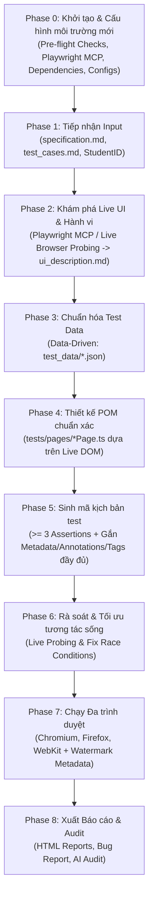

# 🤖 Master Automation QA Testing Skill

> **Mô tả:** Agent Skill chuyên dụng điều phối toàn diện quy trình kiểm thử tự động End-to-End cho các ứng dụng Web (SUT), tuân thủ chiến lược **AI-First**, **Portability (Áp dụng linh hoạt cho mọi tính năng và mọi dự án)**, **Live Interactive Discovery (Playwright MCP / Browser Probing)**, **Đầy đủ Metadata & Test Annotations chống gian lận**, kiến trúc **Page Object Model (POM)**, kiểm thử **Data-Driven**, chạy đa trình duyệt và tạo lập báo cáo minh chứng.

---

## 📂 1. Cấu trúc thư mục chuẩn (Standard Directory Structure)

```text
├── agent_skill/                  # [PORTABLE] Thư mục chứa toàn bộ quy trình & công cụ tái sử dụng
│   ├── SKILL.md                  # Tài liệu điều phối chuẩn 8 Phase (kèm Phase 0: Bootstrap)
│   ├── specification.md          # Đặc tả tính năng, URL SUT, MSSV (Input linh hoạt cho từng bài toán)
│   ├── test_cases.md             # Danh sách >= 12 Test Cases (Input linh hoạt cho từng bài toán)
│   ├── ui_description.md         # Phân tích DOM & Locators bóc tách từ Live SUT
│   └── scripts/                  # Scripts tiện ích điều phối tự động
│       ├── scan_ui.ts            # Script tự động quét và bóc tách DOM phần tử SUT
│       └── orchestrator.ts       # Script điều phối toàn diện quy trình
├── test_data/                    # Dữ liệu kiểm thử tách rời (Data-Driven)
│   ├── [feature_id]_data.json    # File JSON chứa ma trận dữ liệu kiểm thử
├── tests/
│   ├── pages/                    # Page Object Model (POM) Classes
│   │   ├── [Feature]Page.ts
│   │   └── ...
│   ├── [feature_id].spec.ts      # Kịch bản kiểm thử (>= 3 Assertions, gắn Annotations & Tags đầy đủ)
├── reports/                      # Báo cáo thực thi HTML đa trình duyệt
│   ├── html_report/              # Báo cáo HTML hiển thị toàn bộ Metadata & Annotations
│   └── test-results/
├── Bug_Report.md                 # Báo cáo lỗi SUT phát hiện được
├── AI_Critique_and_Audit_Report.md # Phụ lục AI Audit & Đánh giá phản biện AI
├── playwright.config.ts          # Cấu hình Playwright, Browsers & Watermark Metadata
├── tsconfig.json                 # Cấu hình TypeScript độc lập
└── package.json                  # Định nghĩa dependencies & scripts thực thi
```

---

## 🔄 2. Quy trình điều phối 9 bước chuẩn hóa (Phase 0 đến Phase 8)



---

### 🔹 Phase 0: Cấu hình Tiền khả thi & Khởi tạo Môi trường (Pre-Flight & Project Bootstrap)

> ⭐ **Mục tiêu:** Đảm bảo khi copy thư mục `agent_skill/` sang một dự án hoàn toàn mới, Agent sẽ tự động thiết lập 100% môi trường mà không gặp bất kỳ lỗi thiếu thư viện hay cấu hình nào.

1. **Khởi tạo và cài đặt Dependencies:**
   - Nếu dự án mới chưa có `package.json`: chạy `npm init -y`.
   - Cài đặt bộ công cụ Playwright & TypeScript:
     ```bash
     npm install -D @playwright/test typescript @types/node ts-node
     ```
   - Cài đặt Browser Binaries của Playwright:
     ```bash
     npx playwright install chromium firefox webkit
     ```
2. **Khởi tạo các cấu hình chuẩn độc lập:**
   - **`tsconfig.json`**: Cấu hình TypeScript với `"noEmit": true`, `"types": ["node"]`, `"target": "ES2022"`.
   - **`package.json` Scripts**: Bổ sung sẵn các lệnh tiện ích:
     ```json
     "scripts": {
       "test": "playwright test",
       "test:ui": "playwright test --ui",
       "test:chromium": "playwright test --project=chromium",
       "test:chromium:ui": "playwright test --project=chromium --ui",
       "test:firefox": "playwright test --project=firefox",
       "test:webkit": "playwright test --project=webkit",
       "report": "playwright show-report reports/html_report",
       "scan:ui": "tsc && node agent_skill/scripts/scan_ui.js",
       "orchestrate": "tsc && node agent_skill/scripts/orchestrator.js"
     }
     ```
3. **Kiểm tra trạng thái SUT & Playwright MCP:**
   - Đảm bảo Backend và Frontend của SUT đang mở và phản hồi trên các port chỉ định trong `specification.md` (ví dụ: `http://localhost:5173`, `http://localhost:3000`).

---

### 🔹 Phase 1: Tiếp nhận & Kiểm tra dữ liệu đầu vào (Input Ingestion)
1. **Đọc `agent_skill/specification.md`**:
   - Trích xuất: Mã tính năng (`Feature ID`), URL hệ thống (`Base URL`), tài khoản kiểm thử, định dạng dữ liệu ưu tiên (`JSON` / `CSV`), thông tin sinh viên (`StudentID`, `StudentName`).
2. **Đọc `agent_skill/test_cases.md`**:
   - Đảm bảo có tối thiểu **12 Test Cases** kết hợp đủ các nhóm kiểm thử tiêu chuẩn:
     - **Positive Cases:** Luồng chính (Happy path), luồng nghiệp vụ phụ, luồng khôi phục trạng thái.
     - **Negative Cases:** Bỏ trống trường bắt buộc, sai định dạng, dữ liệu không hợp lệ, vi phạm ràng buộc bảo mật hoặc quyền truy cập.
     - **Boundary & Edge Cases (BVA):** Giá trị biên dưới, giá trị biên trên, tràn số, sửa đổi dữ liệu bất thường (ví dụ: giá trị 0đ/âm), điều kiện đồng thời (Race condition), hoặc kiểm thử co giãn giao diện (Responsive/Layout overflow).

---

### 🔹 Phase 2: Khám phá Giao diện & Hành vi Sống (Live Interactive UI Discovery)

> ⭐ **Nguyên tắc cốt lõi:** Tuyệt đối **KHÔNG** sinh mã kiểm thử dựa trên phán đoán tĩnh. Phải dùng công cụ Browser Automation (Playwright MCP / Browser Scanner) tương tác trực tiếp với SUT trên môi trường thực tế.

1. **Phương pháp tương tác sống (Live Probing Workflow):**
   * **Phương thức A (Playwright MCP / Interactive Probing):**
     - Điều khiển browser truy cập trực tiếp các URL mục tiêu được khai báo trong `specification.md`.
     - Tương tác thực nghiệm từng luồng: nhập đúng, nhập rỗng, nhập sai định dạng, thử các thao tác biên để quan sát phản hồi thực tế của UI/API.
     - Ghi nhận trạng thái DOM thực tế: liên kết `<label for="...">`, các thuộc tính input (`required`, `pattern`, `type`), class CSS và role của các thông báo lỗi/thành công.
   * **Phương thức B (Automated Scanner Tool):**
     - Chạy script tích hợp sẵn: `npm run scan:ui`.
2. **Cập nhật dữ liệu vào `agent_skill/ui_description.md`**: Đóng gói bảng ánh xạ Robust Locators, cây DOM thực tế và ghi chú hành vi SUT làm căn cứ vững chắc cho Phase 4.

---

### 🔹 Phase 3: Chuẩn hóa dữ liệu kiểm thử (Data-Driven Processing)
1. **Tạo file dữ liệu `test_data/[feature_id]_data.json`** (hoặc `.csv`):
   - Tách biệt 100% dữ liệu kiểm thử khỏi mã nguồn (nghiêm cấm hardcode mảng dữ liệu trong script test).
   - Cấu trúc dữ liệu chuẩn hóa:
     ```json
     [
       {
         "id": "TC_FRXX_01",
         "category": "Positive",
         "subCategory": "Happy Path",
         "name": "Mô tả mục tiêu kịch bản kiểm thử",
         "inputs": {
           "field1": "sample_value_1",
           "field2": "sample_value_2"
         },
         "precondition": "Trạng thái tiền điều kiện",
         "expected": {
           "status": "success",
           "targetUrl": "/expected_path",
           "message": "Thông báo kỳ vọng"
         }
       }
     ]
     ```

---

### 🔹 Phase 4: Thiết kế kiến trúc Page Object Model (POM Design)
1. **Tạo class POM tương ứng** trong `tests/pages/[Feature]Page.ts`.
2. **Nguyên tắc định danh Selector bền vững (Robust Selectors) từ kết quả Live Probing**:
   - ✅ **Ưu tiên 1:** `this.page.getByRole('button', { name: /.../i })`
   - ✅ **Ưu tiên 2:** `this.page.getByRole('textbox')`, `this.page.getByPlaceholder('...')`, `this.page.getByLabel('...')`
   - ✅ **Ưu tiên 3:** `this.page.getByText('...')`, `this.page.getByTestId('...')`, `this.page.locator('[role="alert"]')`
   - ❌ **Tránh:** XPath tuyệt đối hoặc CSS selector phụ thuộc vào thứ tự lồng nhau dễ vỡ.
3. **Đóng gói hành vi nghiệp vụ:**
   - Xây dựng các hàm tương tác hoàn chỉnh đại diện cho hành động người dùng (ví dụ: `submitForm()`, `performAction()`, `getErrorMessage()`, `checkFieldValidity()`).
   - Sử dụng điều hướng nội bộ (Client-Side Navigation) khi cần bảo toàn trạng thái bộ nhớ (in-memory state).

---

### 🔹 Phase 5: Sinh mã kịch bản kiểm thử (Script Generation with Annotations & Tags)

> ⭐ **BẮT BUỘC:** Mọi Test Case trong file spec phải được gắn **Tags** và **Annotations** đầy đủ để phục vụ truy vết (Traceability) và hiển thị trực quan trên HTML Report.

1. **Tạo file kịch bản** trong `tests/[feature_id].spec.ts`.
2. **Gắn Tags & Annotations chuẩn hóa cho từng Test Case:**
   ```typescript
   test('[TC_FRXX_01] Mô tả kịch bản kiểm thử', {
     tag: ['@[FeatureID]', '@Positive', '@[Domain]', '@StudentID-[StudentID]'],
   }, async ({ page }, testInfo) => {
     // Gắn chi tiết Annotations để hiển thị trên HTML Report
     testInfo.annotations.push(
       { type: 'TestCaseID', description: 'TC_FRXX_01' },
       { type: 'Category', description: 'Positive / Happy Path' },
       { type: 'Author', description: '[Tên Sinh Viên] (StudentID: [StudentID])' },
       { type: 'Description', description: 'Mô tả chi tiết mục tiêu kiểm thử' },
       { type: 'ExpectedResult', description: 'Kết quả kỳ vọng chi tiết của kịch bản' }
     );

     // Thân kịch bản kiểm thử...
   });
   ```
3. **Áp dụng ít nhất 3 – 4 mẫu Assertion riêng biệt**:
   - 🎯 **Mẫu 1 (URL Navigation):** `await expect(page).toHaveURL(/expected_path/)`
   - 🎯 **Mẫu 2 (Element Visibility):** `await expect(featurePage.successElement).toBeVisible()`
   - 🎯 **Mẫu 3 (HTML5 Validity):** `expect(await featurePage.getFieldValidity()).toBe(false)`
   - 🎯 **Mẫu 4 (Alert Text / Regex Match):** `await expect(featurePage.alertBox).toContainText(/kỳ vọng/i)`
   - 🎯 **Mẫu 5 (CSS Box Layout / Responsive):** `expect(box.width).toBeLessThanOrEqual(containerWidth)`
4. **Vòng lặp Data-Driven & Quản lý trạng thái:**
   - Đọc dữ liệu từ file JSON/CSV, lặp qua từng phần tử và thực thi độc lập.

---

### 🔹 Phase 6: Rà soát & Tối ưu hóa (Code Review & Auto-Refinement)
1. **Loại bỏ Flaky Waits:** Sử dụng Smart Explicit Waits (`toBeVisible()`, `waitForURL()`, `toPass()`) thay vì lệnh sleep tĩnh.
2. **Xử lý Race Conditions:** Đảm bảo dọn dẹp phiên làm việc (Teardown/Reset state) giữa các test case nếu có chia sẻ trạng thái.
3. **Xác thực trực tiếp bằng Live Run:** Chạy thử trên 1 trình duyệt trước khi nhân rộng ra toàn bộ suite.

---

### 🔹 Phase 7: Cấu hình & Thực thi đa trình duyệt (Multi-Browser & Anti-Cheat Metadata)

> ⭐ **BẮT BUỘC:** File `playwright.config.ts` phải nhúng toàn bộ thông tin sinh viên và phiên chạy vào `metadata` cấp toàn cục (Global Metadata).

1. **Cấu hình chuẩn trong `playwright.config.ts`**:
   - Hỗ trợ tối thiểu 3 Browser Engines: **Chromium**, **Firefox**, **WebKit**.
   - Chỉ định `testMatch: /.*\.spec\.ts$/` để quét chính xác kịch bản test.
   - **Nhúng Watermark Metadata bắt buộc:**
     ```typescript
     metadata: {
       'Run by': '[StudentID]',
       'Student ID': '[StudentID]',
       'Student Name': '[Tên Sinh Viên]',
       'Course': 'Kiểm thử phần mềm (Software Testing)',
       'Execution Date': new Date().toISOString(),
       'App URL': 'http://localhost:5173',
       'Environment': 'Localhost / SUT EShop',
     }
     ```
   - Chụp ảnh tự động khi lỗi: `screenshot: 'only-on-failure'`.
2. **Các lệnh thực thi tiện ích:**
   ```bash
   # Chạy toàn bộ 3 trình duyệt
   npm test

   # Chạy riêng từng trình duyệt (Headless)
   npm run test:chromium
   npm run test:firefox
   npm run test:webkit

   # Mở giao diện UI tương tác (Interactive UI Mode)
   npm run test:ui
   npm run test:chromium:ui
   ```

---

### 🔹 Phase 8: Báo cáo Bug SUT & AI Critique Audit (Output Delivery)
1. **Biên tập `Bug_Report.md`**:
   - Tổng hợp ma trận lỗi phát hiện từ SUT (Severity, Priority, Steps to Reproduce, Expected vs Actual, Root Cause, Screenshots).
2. **Biên tập `AI_Critique_and_Audit_Report.md`**:
   - Ghi lại nhật ký phiên làm việc (Session Log: Tool name, Timestamp, Prompt, Output).
   - Đoạn văn 200 – 300 từ phân tích phản biện chuyên sâu các lỗi sai của AI và bài học rút ra.
   - Minh chứng Watermark Metadata và Annotations chống gian lận.

---

## 🛡️ 3. Các nguyên tắc tối thượng & Chống lặp Fallback (Execution Guardrails & Anti-Fallback Policy)

> 💡 **Triết lý kiểm thử:** Quy trình kiểm thử được thiết kế theo chuẩn **Hộp Đen (Black-box)** trên môi trường độc lập. Các kịch bản kiểm thử có thời gian chờ đặc thù hoặc chuyển đổi trạng thái bất đồng bộ sẽ được thực thi **trọn vẹn và tự nhiên** theo đúng luồng nghiệp vụ người dùng mà không bị can thiệp rút ngắn gượng ép. Mục tiêu cốt lõi là **loại bỏ hoàn toàn các vòng lặp fallback / chẩn đoán ngoài luồng**.

### 🚫 1. Tuyệt đối tuân thủ ranh giới Hộp Đen (Strict Black-Box & Workspace Boundary)
* **Không tra cứu thư mục bên ngoài:** Xem workspace hiện tại là độc nhất trên máy mới. Tuyệt đối không mở, tìm kiếm hay can thiệp vào mã nguồn gốc của hệ thống ở các thư mục bên ngoài.
* **Chỉ tương tác qua Web UI bằng Playwright:** Toàn bộ quá trình kiểm thử phải được thực hiện thông qua trình duyệt và các class Page Object Model (`[Feature]Page.ts`). Không tự ý viết các script gửi HTTP request ngầm (`fetch`/`axios`) trực tiếp vào cổng Backend nếu bài kiểm thử nhắm vào giao diện người dùng.

### 🔄 2. Thực thi tuyến tính 1 lần, không lặp lại Fallback (Single-Pass Execution, No Diagnostic Loops)
* **Quy trình 1 chiều dứt khoát:** Thực thi lần lượt từ Phase 0 đến Phase 8 một cách mạch lạc.
* **Ghi nhận khách quan hành vi SUT:** Khi một test case phát hiện lỗi thực tế của SUT (ví dụ: SUT không phản hồi đúng theo đặc tả), để Playwright ghi nhận kết quả và chụp màn hình tự động. Ghi nhận lỗi đó trực tiếp vào `Bug_Report.md` thay vì rơi vào vòng lặp chẩn đoán, thăm dò hay cố gắng can thiệp sửa đổi SUT.

### ⏱️ 3. Để các ca kiểm thử chạy đủ thời gian tự nhiên (Natural Test Timing)
* Đối với các ca kiểm thử có ràng buộc về thời gian hoặc xử lý hàng đợi, kịch bản cần kiên nhẫn chờ đủ thời gian thực tế theo đúng nghiệp vụ để quan sát phản hồi thực của hệ thống.
* Tránh việc thăm dò liên tục gây xung đột trạng thái trong lúc đang đợi hoàn tất tác vụ.

---

## 📦 4. Danh mục kết quả đầu ra cam kết (Deliverables Checklist)

| STT | Tên sản phẩm đầu ra | Vị trí file / Định dạng | Yêu cầu đạt chuẩn |
| :---: | :--- | :--- | :--- |
| **0** | **Môi trường & Cấu hình độc lập** | `package.json`, `tsconfig.json`<br>`playwright.config.ts` | Tự động bootstrap, sẵn sàng các trình duyệt người dùng chọn |
| **1** | **Automation Test Scripts** | `tests/[feature].spec.ts`<br>`tests/pages/[Page].ts` | Chuẩn POM, Data-driven, $\ge 3$ loại assertions, **đầy đủ Tags & Annotations** |
| **2** | **Test Data Files** | `test_data/[feature]_data.json` | Tách biệt hoàn toàn, cấu trúc rõ ràng cho $\ge 12$ Test Cases |
| **3** | **Multi-browser HTML Reports** | `reports/html_report/index.html` | Đầy đủ các trình duyệt người dùng chọn, **Metadata & Annotations hiển thị rõ ràng** |
| **4** | **Bug Reports & Screenshots** | `Bug_Report.md`<br>`reports/test-results/**/*.png` | Chi tiết Steps to Reproduce, Expected vs Actual, Screenshots lỗi thực tế |
| **5** | **AI Critique & Audit Report** | `AI_Critique_and_Audit_Report.md` | Đầy đủ log phiên, prompt, phân tích lỗi sai AI (200 - 300 từ), minh chứng Watermark |
| **6** | **Tài liệu hướng dẫn tái sử dụng** | `agent_skill/SKILL.md` | Tích hợp Phase 0 Bootstrap, Live Browser Discovery & Strict Guardrails sẵn sàng cho mọi dự án |